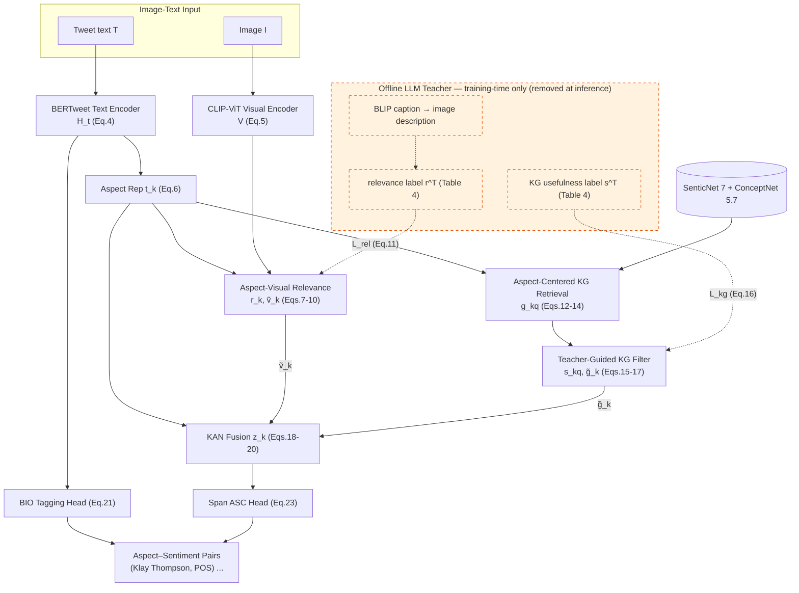

# TARKAN

**Teacher-Guided Aspect-Relevant Knowledge Fusion with KAN for Multimodal Aspect-Based Sentiment Analysis**
Lipika Dewangan, Udit Senapaty, Chandresh Kumar Maurya.

A faithful, runnable reimplementation of TARKAN — joint multimodal ABSA on Twitter-2015/2017 with an
offline LLM teacher (training-time only), aspect-centered SenticNet+ConceptNet retrieval, and a
Kolmogorov–Arnold Network fusion head. Exact formulas (Eqs. 1–25) and §4.3 hyperparameters; no stubs.

> Full spec → [`implementation-plan.md`](implementation-plan.md). GPU-server run guide → [`walkthrough.md`](walkthrough.md).

## Architecture



Solid = student (used at train **and** inference). Dashed = LLM-teacher supervision (train only).
Objective: `L = L_tag + λ1·L_rel + λ2·L_kg + λ3·L_asc` (Eq. 25 + auxiliary; `λ1=λ2=0.5`, `λ3=1.0`).

## Repository layout

| Area | Files |
|---|---|
| Root pipeline | `config.py models.py encoders.py relevance.py kg.py kg_retrieval.py kg_filter.py kan_fusion.py heads.py data.py losses.py metrics.py teacher.py captioner.py train.py evaluate.py seeding.py utils.py` |
| Setup (server-first) | `data_setup.py`, `scripts/` (download ConceptNet/SenticNet, build KG, prepare data, clone baselines, teacher labeling) |
| Experiments | `experiments/` (Table 1, 3) · `ablations/` (Table 6, 10) · `analysis/` (Table 5, 7, 8, 9) · `visualizations/` |
| Baselines | `referred_clones/` (verified repos, `.git` stripped, per-repo fixes in `FIXES.md`) |
| Tests | `tests/` (deterministic CPU battery) |

## Models & data (open-source)

- Text `vinai/bertweet-base` · Visual `openai/clip-vit-base-patch32` · Teacher `Qwen/Qwen2.5-7B-Instruct` (4-bit) · Captioner `Salesforce/blip-image-captioning-large` · KAN `efficient-kan` (B-spline) with `fastkan`/`rkan`/vendored-RBF fallbacks.
- Data: `CopotronicRifat/TwitterDataMABSA` (Twitter-2015 **and** 2017 + images). ConceptNet 5.7 (EN) + SenticNet 7 (EN).
- Secrets in `.env.local` (only `HF_TOKEN` required). Heavy artifacts are git-ignored.

## Quickstart

```bash
python -m venv myenv && myenv/Scripts/pip install -r requirements.txt   # +torch CPU index, see requirements.txt
myenv/Scripts/python -m pytest tests/ -q          # deterministic battery (CPU, no downloads) — must be green
cp .env.example .env.local                         # add HF_TOKEN
```
Then follow [`walkthrough.md`](walkthrough.md) on the T4 server: `python data_setup.py` → `python train.py` → experiments.

## Status
Deterministic CPU battery green (23 tests). Full training/teacher-labeling targets a single T4 (16 GB).
See `implementation-plan.md` §14 for documented paper ambiguities and defaults.
